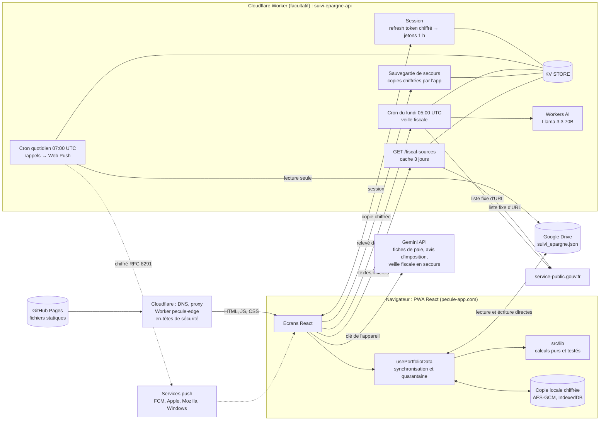

<div align="center">


# Pécule

**Faites pousser votre épargne.**

Tableau de bord d'épargne personnel, calibré pour la fiscalité française.
Sans base de données : vos données restent dans **un seul fichier, sur votre propre Google Drive**.

[](https://github.com/antoninnourisson-cloud/suivi-epargne/actions/workflows/ci.yml)
[](https://github.com/antoninnourisson-cloud/suivi-epargne/actions/workflows/deploy.yml)
[](https://github.com/antoninnourisson-cloud/suivi-epargne/actions/workflows/worker.yml)
[](https://github.com/antoninnourisson-cloud/suivi-epargne/actions/workflows/edge.yml)
[](https://github.com/antoninnourisson-cloud/suivi-epargne/actions/workflows/monitor.yml)
[](LICENSE)
[](https://pecule-app.com/)

[](https://react.dev/)
[](https://www.typescriptlang.org/)
[](https://vite.dev/)
[](https://tailwindcss.com/)
[](https://recharts.org/)
[](https://vitest.dev/)
[](https://playwright.dev/)
[](https://m3.material.io/)
[](.nvmrc)
[](worker/)

[**Ouvrir l'app**](https://pecule-app.com/) ·
[Confidentialité](https://pecule-app.com/confidentialite.html) ·
[Nouveautés](https://github.com/antoninnourisson-cloud/suivi-epargne/releases) ·
[Maintenance](MAINTENANCE.md) ·
[Feuille de route](ROADMAP.md) ·
[Wiki](https://github.com/antoninnourisson-cloud/suivi-epargne/wiki) ·
[Contact](mailto:contact@pecule-app.com)


</div>

---

## Sommaire

- [Présentation](#présentation)
- [Fonctionnalités](#fonctionnalités)
- [Architecture](#architecture)
- [Modèle de données et invariants](#modèle-de-données-et-invariants)
- [Sécurité et confidentialité](#sécurité-et-confidentialité)
- [Démarrage rapide](#démarrage-rapide)
- [Déploiement](#déploiement)
- [Structure du projet](#structure-du-projet)
- [Installer l'app sur mobile](#installer-lapp-sur-mobile)
- [Contribuer](#contribuer)
- [Licence](#licence)
- [Crédits](#crédits)

## Présentation

Pécule (anciennement *Suivi Épargne*) est une application web installable (PWA) pour suivre ses comptes d'épargne, piloter sa paie mois après mois et anticiper sa fiscalité : livrets réglementés, PEA, assurance vie, PEE, PER, crypto.

- **Pas de base de données.** Tout tient dans `suivi_epargne.json`, sur le Google Drive de l'utilisateur. L'app ne voit que les fichiers qu'elle a créés (portée OAuth `drive.file`).
- **Un serveur facultatif.** Un petit Cloudflare Worker ([`worker/`](worker/)) apporte ce qu'un navigateur seul ne peut pas faire : une session Google persistante, des notifications push quotidiennes, la veille fiscale hebdomadaire (pages officielles lues par Cloudflare Workers AI) et une sauvegarde de secours chiffrée par l'app, qu'il ne peut pas lire. Sans lui, l'app fonctionne entièrement dans le navigateur.
- **Rien n'est appliqué sans vous.** Échéances récurrentes, propositions de la veille fiscale, données extraites d'une fiche de paie : tout est proposé, puis validé par l'utilisateur.

## Fonctionnalités

### Tableau de bord
- **Épargne nette** répartie entre *disponible*, *contrainte fiscale* (AV/PEA récents : impôt en plus d'un retrait anticipé, date où il devient gratuit) et *bloqué* (PEE, PER…).
- **Un chiffre principal** : épargne nette, variation sur 30 jours et courbe sur un an ; les détails moins utiles sont repliés.
- **À faire** : les trois actions les plus importantes, avec « Plus tard », **chiffrées en euros** quand c'est possible (argent qui dort sur le compte courant, compte mieux rémunéré qui a de la place, livret bientôt plein). Plafonds des livrets, révision des taux réglementés (1er février et 1er août), éligibilité au LEP, soldes non actualisés, comptes vides inactifs, intérêts parentaux de fin d'année.
- **Placé depuis la paie** (jauge face au plan d'épargne), **taux d'épargne** sur douze mois, **épargne de précaution**.
- **Projection** à 6 et 12 mois d'après le rythme réel des 90 derniers jours, avec une alerte si le rythme dérive.
- Prélèvements des 7 prochains jours, évolution empilée par compte, répartition par établissement.
- Pastille sur l'icône de l'app installée : nombre de choses à faire.

### Comptes et mouvements
- **Part propre et capital des parents** distingués sur chaque compte. Le capital parental est intouchable, ses intérêts reviennent à l'utilisateur.
- **Actualiser solde** : nouveau solde, total affiché par la banque, ou ajustement « + / − x € ».
- **Versements cumulés** (PEA, assurance vie, crypto…) : un versement se distingue d'une variation de valeur.
- **Journal des modifications** : mouvements, taux, restitution. Annulation, mouvements de test qui s'annulent repérés, marquage « Pas de l'épargne », « Repartir de zéro » à une date sans rien effacer.
- **Recherche** dans tous les mouvements, étiquettes, virements internes liés, mouvements récurrents mensuels.
- **Ajout rapide** : bouton flottant et raccourcis de l'icône installée (ajouter, actualiser, virements de paie).
- **Taux des livrets datés** (date d'effet), mis à jour pour tous les livrets concernés d'un coup. **Conseil quinzaine** avant un retrait de livret.

### Paie et budget
- Calcul du **« super net »** : barème progressif, décote, charges salariales, CSG non déductible, abattement de 10 %, Navigo, mutuelle, titres-restaurant. **Mode exact** d'après une fiche de paie. Avantages salariaux pré-remplis depuis les fiches de paie.
- **Votre paie, virement par virement** : liste à cocher (charges fixes, abonnements, épargne projets, argent plaisir, répartition de l'épargne entre les comptes), versements enregistrés en un clic.
- **Répartition personnalisée** de l'épargne à partir d'une date, stratégie de placement selon les taux et plafonds, durée de survie.
- **Fiches de paie** : import depuis Drive (Google Picker), extraction par Gemini (nouvelles tentatives, modèles de repli), relecture obligatoire, graphique du net, hausse de salaire repérée.

### Rendement et fiscalité
- **Intérêts réellement acquis** (règle des quinzaines), intérêts attendus au 31 décembre, taux pondérés dans le temps, manque à gagner du cash dormant.
- **Rendement net** et projection selon la répartition (100 % Livret A, votre répartition, 100 % assurance vie) sur 5, 10 ou 20 ans.
- **Gains nets si retrait** : PFU, prélèvements sociaux (18,6 %, 17,2 % sur l'assurance vie), part en fonds euros de l'AV, exonération du PEA et du PEE après maturité, abattement de l'AV après 8 ans, cession crypto exonérée jusqu'à 305 €. Plus-values latentes, plafond du PEA, compte à rebours de maturité (« horloge fiscale »).
- **LEP** : plafonds de revenus, alerte et date de fermeture probable. L'avis d'imposition (PDF ou photo) est lu par Gemini, qui en relève le revenu fiscal de référence et le nombre de parts.
- **Veille fiscale hebdomadaire** : chaque lundi, le serveur relit les pages officielles de service-public.gouv.fr et en fait relever les taux, plafonds et barèmes par **Cloudflare Workers AI** (sans clé, aucune donnée personnelle envoyée) ; Gemini, avec la clé de l'appareil, sert de secours. L'app compare ces valeurs à ses paramètres et **propose** les changements avec leur source ; « Détail du relevé » montre chaque valeur lue, la phrase de la page et « = app » ou « ≠ app ». Barèmes de l'impôt à jour (2026), anciens barèmes conservés.
- **Dons** : réductions de 66 % et 75 % (plafond de 2 000 €), plafonnées à l'impôt, reçus joints depuis Drive, **aide à la déclaration case par case** (1AJ, 8HV, 7UD, 7UF…).

### Motivation et simulateur
- **Bons mois** : au moins 500 € mis de côté sur les 30 jours qui suivent chaque paie (seuil réglable, désactivable), série de bons mois et un joker par an.
- **Jalons** (premier bon mois, épargne de précaution, livret plein, 10 000 €…), signalés une seule fois.
- **Point de paie** à chaque paie : prévu et réalisé, compte par compte. **Contrôle des fiches de paie** : une fiche qui s'écarte nettement de la médiane des six précédentes est signalée.
- **Simulateur « Et si… »** (Analyses) : un achat, une pause ou un autre montant d'épargne, projeté sur 1 à 5 ans avec une fourchette tirée de vos propres mois passés.

### Agenda, bilans et parents
- **Agenda des douze mois** : paies, prélèvements, révisions de taux, rendez-vous fiscaux, maturités, fermeture du LEP, restitution.
- **« Votre année »** (Historique) : l'année d'épargne racontée en quelques pages (mis de côté, intérêts, bons mois, meilleur mois, jalons, cap sur l'année suivante).
- **Abonnements** : rappel avant prélèvement, revue annuelle (coût, hausses, date limite de résiliation).
- **Restitution du capital parental** : date conseillée (le 1er janvier garde toute l'année d'intérêts), montants par compte, rappels, enregistrement en un clic et relevé exportable, puis **mode solo** et **plan solo 2027-2030**.

### Notifications, sécurité et données
- **Notifications push** appareil par appareil (avec le serveur), **activables type par type** : jour de paie, abonnements, échéances, soldes, taux, LEP, impôts, parents, bilans. Mode **discret** sans aucun montant.
- **Verrou de l'appareil** : biométrie (WebAuthn) ou code PIN de 6 à 8 chiffres (PBKDF2), réactivé dès que l'app passe en arrière-plan.
- **Sauvegardes** : copie mensuelle sur Drive (12 mois restaurables), copie locale de secours **chiffrée**, export et import JSON, export CSV, et **sauvegarde de secours chiffrée de bout en bout** sur le serveur (facultative, code de secours détenu par l'utilisateur seul).
- **Conflits entre appareils** détectés après chaque écriture Drive : l'utilisateur choisit la version à garder, rien n'est écrasé en silence.
- **Quoi de neuf** après chaque mise à jour, historique complet dans Paramètres. Mode sombre.

## Architecture



- **Les données financières ne transitent pas en clair par le serveur**, sauf la lecture quotidienne du fichier pour calculer les rappels, dont il ne garde rien. La sauvegarde de secours lui arrive déjà chiffrée, sans la clé.
- **La veille fiscale du serveur** n'envoie à Workers AI que le texte des pages publiques ; le relevé (`fiscal-watch:latest`) est comparé aux paramètres par l'app, jamais appliqué d'office.
- **Le site** est servi par GitHub Pages, derrière le proxy Cloudflare : le Worker `pecule-edge` ([`edge/`](edge/)) n'ajoute que des en-têtes de sécurité (HSTS, anti-iframe, politique de permissions). L'ancienne adresse github.io redirige vers pecule-app.com.
- **Le cron réutilise le code de l'app** (`src/lib/`, `src/types.ts`, `src/constants.ts`) : une notification dit exactement ce que dit la bannière correspondante.
- **Synchronisation robuste** (`src/hooks/usePortfolioData.ts`) : contrôle de révision Drive (aucune écriture à l'aveugle), écritures en série, quarantaine locale des modifications non synchronisées, coordination entre onglets, mode hors ligne, délais maximaux sur les appels réseau, rechargement automatique quand une nouvelle version est déployée.

Détail du serveur, de ses routes et de son stockage : [worker/README.md](worker/README.md).

## Modèle de données et invariants

Un seul document JSON (`GlobalAppData`, [`src/types.ts`](src/types.ts)) : comptes et mouvements, charges, historiques mensuels, objectifs, fiches de paie, mouvements récurrents, abonnements, dons, paramètres fiscaux (`fiscalConfig`), avantages salariaux, configuration.

| Règle | Où |
|---|---|
| Tout ce qui entre (Drive, import, restauration, autre onglet, Worker) passe par **`migrate()`**. Les champs inconnus sont **conservés**. | [`src/lib/schema.ts`](src/lib/schema.ts) |
| `APP_SCHEMA_VERSION` n'augmente que si un ancien client deviendrait dangereux. Il refuse alors d'écrire. | `src/lib/schema.ts` |
| **Tout changement de solde** passe par `applyMovement`, `snapshotBalances`, `restoreBalances`. Total = part propre + part des parents, au centime. | [`src/lib/accountOps.ts`](src/lib/accountOps.ts) |
| `kind` d'un mouvement : aucun (versement réel), `valuation`, `parental`, `adjustment`. **Seul `isSavingsFlow`** décide de ce qui compte comme épargne. | [`src/lib/finance/savings.ts`](src/lib/finance/savings.ts) |
| Le capital des parents n'est jamais proposé comme source d'un retrait. Ses intérêts reviennent à l'utilisateur. | `src/lib/finance/interest.ts`, `restitution.ts` |
| La clé Gemini ne quitte jamais l'appareil (`withoutDeviceOnlyFields`, ignorée par `canonicalize`). | `src/lib/schema.ts` |
| Les noms techniques `suivi-epargne` (dépôt, URL, fichier Drive, Worker) ne changent pas. | — |

Liste complète et raisons : [MAINTENANCE.md §1](MAINTENANCE.md#1-invariants-à-ne-pas-casser).

## Sécurité et confidentialité

- **Moindre privilège Google** : `drive.file` uniquement (les fichiers créés par l'app), plus `openid` et `email` côté serveur pour l'identité. Aucune portée sensible, aucun envoi d'e-mail.
- **CSP stricte** dans [`index.html`](index.html) : aucun script intégré, origines limitées à Google et à l'origine **exacte** du Worker (injectée au build par `vite.config.ts`).
- **En-têtes HTTP** ajoutés par le Worker `pecule-edge` devant GitHub Pages : HSTS, `X-Frame-Options: DENY` et `frame-ancestors 'none'`, `nosniff`, `Referrer-Policy`, `Permissions-Policy`, `Cross-Origin-Opener-Policy` (détail : [MAINTENANCE.md § 8](MAINTENANCE.md#8-nom-de-domaine)).
- **Serveur** :
  - refresh token chiffré en AES-256-GCM ;
  - sessions stockées hachées (SHA-256), expirées après 30 jours d'inactivité et 60 jours au plus ;
  - state OAuth signé (HMAC) et lié au navigateur par un cookie `__Host-` ;
  - `id_token` vérifié ;
  - liste blanche `ALLOWED_EMAILS` ;
  - limitation de débit par IP ;
  - corps des requêtes limités à 4 Ko (2 Mo pour la sauvegarde de secours) ;
  - push chiffré de bout en bout (RFC 8291).
- **Sauvegarde de secours chiffrée de bout en bout** (facultative, Paramètres) : l'app chiffre ses données (AES-256-GCM, clé dérivée par HKDF-SHA-256 d'un code de secours de 128 bits montré une seule fois) avant de les confier au Worker (KV, 8 copies au plus, 1 an chacune). Le serveur ne voit ni le code ni la clé ; l'appareil garde seulement une clé non exportable, limitée au chiffrement, pour l'envoi hebdomadaire. Sans le code, les copies sont illisibles. Code : [`src/lib/cloudBackupCrypto.ts`](src/lib/cloudBackupCrypto.ts), [`src/services/cloudBackup.ts`](src/services/cloudBackup.ts).
- **Sur l'appareil** : verrou biométrique ou PIN, copie locale chiffrée par une clé non exportable, clé Gemini propre à l'appareil.
- **Tout révoquer** : « Déconnecter tous les appareils » et « Supprimer mes données serveur » dans Paramètres, ou myaccount.google.com/permissions (ce dernier garde la sauvegarde de secours chiffrée : « Désactiver » ou « Supprimer mes données serveur » l'efface).
- **Tiers** : les fiches de paie et l'avis d'imposition envoyés à Gemini contiennent des données personnelles. Avec une clé gratuite, Google peut s'en servir. La veille fiscale (Workers AI, ou Gemini en secours) ne reçoit que des textes publics. Voir les [règles de confidentialité](https://pecule-app.com/confidentialite.html).
- **Dépôt** : CodeQL, détection des secrets et Dependabot (alertes et mises à jour groupées), actions GitHub épinglées par SHA, permissions minimales dans chaque workflow, surveillance quotidienne de la production.

Signaler une faille : voir [SECURITY.md](SECURITY.md). Contact : [contact@pecule-app.com](mailto:contact@pecule-app.com).

## Démarrage rapide

Prérequis : **Node.js 22+** (version de référence dans [`.nvmrc`](.nvmrc)).

```bash
npm ci                 # dépendances de l'app
npm ci --prefix worker # dépendances du serveur (nécessaires au typecheck)
npm ci --prefix edge   # dépendances du Worker des en-têtes (idem)

npm run dev            # http://localhost:5173
npm run lint           # ESLint, avec les règles d'accessibilité jsx-a11y (bloquant en CI)
npm run typecheck      # types : app + serveur + edge
npm test               # tests Vitest : app + serveur (worker/test) + edge (edge/test)
npm run test:coverage  # idem, avec les seuils de couverture de vitest.config.ts (comme la CI)
npm run test:watch     # tests en continu
npm run e2e            # tests de bout en bout Playwright, en mode démo (ordinateur et mobile)
npm run build          # build de production dans dist/
npm run preview        # sert le build localement
npm run theme          # régénère src/theme/m3.css depuis scripts/m3-theme.mjs (palette Material)
```

Pour `npm run e2e`, installe une fois le navigateur : `npx playwright install chromium` (en local, la config utilise Chrome s'il est installé). Le serveur de développement est lancé automatiquement.

**Mode démo**, sans compte Google : <http://localhost:5173/?demo=1>. L'app se charge avec des données fictives ([`src/dev/demoData.ts`](src/dev/demoData.ts)), et rien n'est lu ni écrit sur Drive. Ce mode n'existe qu'en développement (`import.meta.env.DEV`).

**Avec le serveur local** : dans `worker/`, `npm run setup-secrets -- --dev` (génère `.dev.vars`), puis `npm run dev` (port 8787). Ensuite, à la racine, crée `.env.development.local` :

```
VITE_BACKEND_URL=http://localhost:8787
```

**Configuration Google Cloud** (client OAuth « Application Web », identifiant dans `src/services/googleDriveService.ts`) :
- origines JavaScript : `https://pecule-app.com` et `http://localhost:5173` ;
- URI de redirection (mode serveur) : `https://<worker>.workers.dev/auth/callback` ;
- API activées : Google Drive, Google Picker ;
- écran de consentement **« En production »** (en mode test, les sessions expirent après 7 jours) ;
- une clé API pour le Picker, saisie dans Paramètres (à restreindre par référent HTTP).

## Déploiement

Avant chaque mise à jour visible, ajoute une entrée **en tête** de [`src/changelog.ts`](src/changelog.ts) : version `AAAA.MM.JJ` (suffixe `-2`, `-3`… le même jour), titre et 1 à 6 phrases simples. Elle déclenche « Quoi de neuf » et la GitHub Release.

| Workflow | Déclencheur | Rôle |
|---|---|---|
| [`ci.yml`](.github/workflows/ci.yml) · *Vérifications* | PR, push sur `main`, chaque lundi à 6 h UTC, appel par `deploy.yml` | lint, types, tests avec seuils de couverture, tests de bout en bout Playwright, build (tailles dans le résumé), audit des dépendances (informatif) |
| [`deploy.yml`](.github/workflows/deploy.yml) · *GitHub Pages* | push sur `main` | `ci.yml` → build → GitHub Pages → tag `v<version>` et Release avec les puces du changelog (une fois par version) |
| [`worker.yml`](.github/workflows/worker.yml) · *Serveur* | push sur `main` touchant `worker/`, `src/lib/`, `src/types.ts` ou `src/constants.ts`, ou lancement manuel | types, tests, puis `wrangler deploy` |
| [`edge.yml`](.github/workflows/edge.yml) · *En-têtes de sécurité* | push sur `main` touchant `edge/`, ou lancement manuel | types, tests, puis `wrangler deploy` du Worker `pecule-edge` (HSTS, anti-iframe… devant GitHub Pages ; actif une fois le DNS Cloudflare en « Proxied », voir [MAINTENANCE.md](MAINTENANCE.md#8-nom-de-domaine)) |
| [`monitor.yml`](.github/workflows/monitor.yml) · *Surveillance* | chaque jour à 6 h 30 UTC, ou lancement manuel | site, pages publiques, serveur (`/status`), certificat TLS, HSTS ; ouvre/ferme une issue `panne` |

- **App** : l'URL du serveur est dans [`.env.production`](.env.production). Le commit déployé est injecté au build (`__BUILD_SHA__`).
- **Serveur** : le déploiement est automatique dès que les secrets du dépôt **`CLOUDFLARE_API_TOKEN`** et **`CLOUDFLARE_ACCOUNT_ID`** existent (Settings → Secrets and variables → Actions). Sans eux, le job est sauté, et `npm run deploy` dans `worker/` reste possible. Les secrets du Worker (`GOOGLE_CLIENT_SECRET`, `ENCRYPTION_KEY`, `VAPID_*`, `ALLOWED_EMAILS`) se posent avec `npm run setup-secrets` : voir [worker/README.md](worker/README.md).
- **Dépendances** : Dependabot propose chaque mois des mises à jour mineures et correctives groupées (app, `worker/`, `edge/`, Actions). Toutes les montées majeures npm se font à la main.
- **Retour arrière, pannes, calendrier fiscal** : [MAINTENANCE.md](MAINTENANCE.md).

## Structure du projet

```
.
├── .github/
│   ├── workflows/          ci.yml · deploy.yml · worker.yml · edge.yml · monitor.yml
│   ├── ISSUE_TEMPLATE/     bug · idée · liens (sécurité, contact, code de conduite)
│   ├── pull_request_template.md
│   └── dependabot.yml      app, worker/, edge/, Actions
├── public/                 icônes, police, presentation.html, confidentialite.html, push-sw.js
├── scripts/
│   └── m3-theme.mjs        génère la palette Material 3 (npm run theme → src/theme/m3.css)
├── src/
│   ├── components/         écrans (Dashboard, Agenda, Journal, Yield, Simulator, Settings…)
│   │   ├── ui/             composants Material : Card, StatTile, MoneyText, DataTable, Tabs…
│   │   ├── charts/         cadre commun des graphiques (phrase de synthèse, « Voir les données »)
│   │   ├── motivation/     bons mois, jalons, point de paie, réglages
│   │   ├── pilot/          Pilotage : budget, remplissage des livrets, horloge fiscale…
│   │   ├── simulator/      « Et si… » : éditeur de scénario, graphique
│   │   ├── update/         Actualiser les soldes, une ligne par compte
│   │   ├── year/           « Votre année »
│   │   └── dashboard/      barre disponible / avec impôt / bloqué
│   ├── hooks/              usePortfolioData (état et synchronisation Drive), useFiscalWatch, useTheme…
│   ├── lib/                calculs purs et testés
│   │   ├── commands/       opérations qui changent les soldes, avec leur annulation exacte
│   │   ├── finance/        income · capitalTax · interest · savings · placement ·
│   │   │                   subscriptions · payPlan · donations · fiscalParams · restitution
│   │   ├── finance.ts      réexporte finance/
│   │   ├── accountOps.ts   seule voie de modification des soldes
│   │   ├── schema.ts       migrate(), version du format, canonicalize
│   │   ├── fiscalWatch.ts  veille fiscale (propositions bornées et sourcées)
│   │   ├── cloudBackupCrypto.ts  chiffrement de la sauvegarde de secours, code de secours
│   │   ├── motivation.ts · simulator.ts · alerts.ts · yearReview.ts · driveWriteCheck.ts
│   │   └── lep.ts · notificationPrefs.ts · agenda.ts · planning.ts · projection.ts …
│   ├── services/           Google (Drive, Picker), Gemini, serveur, sauvegarde de secours,
│   │                       push, verrou, coffre local
│   ├── theme/m3.css        rôles de couleur Material (généré)
│   ├── dev/                données du mode démo
│   ├── changelog.ts        historique des mises à jour (« Quoi de neuf », Releases)
│   └── constants.ts · types.ts · navigation.ts · App.tsx · index.tsx · index.css (@theme Tailwind 4)
├── e2e/                    tests Playwright en mode démo (parcours, alertes, motivation,
│                           restitution, simulateur, actualiser, votre année)
├── worker/                 serveur Cloudflare : voir worker/README.md
│   ├── src/                index (routes, crons) · google · sessions · security · crypto ·
│   │                       subscriptions · webpush · reminders · fiscalSources · fiscalWatchJob
│   ├── test/               tests Vitest (OAuth, sessions, push RFC 8291, rappels, sources,
│   │                       veille, sauvegardes, /status)
│   ├── scripts/            setup-secrets.mjs
│   └── wrangler.toml       KV, limiteurs, Workers AI, crons
├── edge/                   Worker pecule-edge : en-têtes de sécurité devant GitHub Pages
│   ├── src/index.ts · test/ · wrangler.toml (routes pecule-app.com)
├── MAINTENANCE.md · ROADMAP.md · CONTRIBUTING.md · SECURITY.md · CODE_OF_CONDUCT.md
├── index.html (CSP) · vite.config.ts (PWA, CSP) · vitest.config.ts · playwright.config.ts
├── eslint.config.js · tsconfig.json
└── .nvmrc · .env.production
```

**Identité visuelle** : Material 3 Expressive, couleur source vert sapin `#14532d` (variante « fidélité »), or `#fbbf24` en tertiaire. La palette est générée par `npm run theme` (`scripts/m3-theme.mjs` → `src/theme/m3.css`) : les échelles Tailwind `indigo` (couleur principale) et `slate`/`gray`/`stone` (neutres) pointent vers les tons Material, et les rôles Material sont disponibles en classes (`bg-surface-container`, `text-on-surface-variant`…). Formes, graisses, élévations et mouvements dans `src/index.css`. Police Google Sans Flex. Logo vectoriel : `src/components/Logo.tsx`.

## Installer l'app sur mobile

- **iPhone** : dans Safari, Partager → *Sur l'écran d'accueil*. Les notifications ne fonctionnent que dans l'app installée.
- **Android** : dans Chrome, menu → *Installer l'application*.

## Contribuer

Pécule est un projet personnel. Les signalements et suggestions sont les bienvenus via les *issues*, ou à [contact@pecule-app.com](mailto:contact@pecule-app.com). Avant toute pull request, lis [CONTRIBUTING.md](CONTRIBUTING.md), les invariants de [MAINTENANCE.md](MAINTENANCE.md) et le [code de conduite](CODE_OF_CONDUCT.md). Une PR doit passer `npm run lint`, `npm run typecheck`, `npm run test:coverage`, `npm run e2e` et `npm run build`. Toute modification visible ajoute une entrée au changelog, et tout chiffre fiscal cite sa source officielle. Le guide d'utilisation est dans le [wiki](https://github.com/antoninnourisson-cloud/suivi-epargne/wiki).

## Licence

[GNU Affero General Public License v3.0 ou ultérieure](LICENSE) (AGPL-3.0-or-later). Vous pouvez utiliser, modifier et redistribuer le code. En contrepartie, toute version modifiée, **y compris proposée en ligne comme service**, doit être publiée sous la même licence, avec son code source.

Le nom « Pécule » et le logo ne sont pas couverts par la licence : une version modifiée doit porter un autre nom.

## Crédits

- Conception et développement : Antonin Nourisson.
- Construit avec [React](https://react.dev/), [Vite](https://vite.dev/), [Tailwind CSS](https://tailwindcss.com/), [Recharts](https://recharts.org/), [Lucide](https://lucide.dev/), [vite-plugin-pwa](https://vite-pwa-org.netlify.app/), [Vitest](https://vitest.dev/), [Playwright](https://playwright.dev/) et [Cloudflare Workers](https://workers.cloudflare.com/).
- Données fiscales de référence : [service-public.gouv.fr](https://www.service-public.gouv.fr/). Extraction de documents : Google Gemini. Veille fiscale : Cloudflare Workers AI (Llama 3.3 70B).
- Police : [Google Sans Flex](https://fonts.google.com/specimen/Google+Sans+Flex) (SIL Open Font License), hébergée avec l'app.
- Design : [Material 3 Expressive](https://m3.material.io/) ; palette générée avec [material-color-utilities](https://github.com/material-foundation/material-color-utilities).

<sub>Pécule n'est pas un conseiller financier : les calculs sont des estimations à vérifier auprès des sources officielles.</sub>
